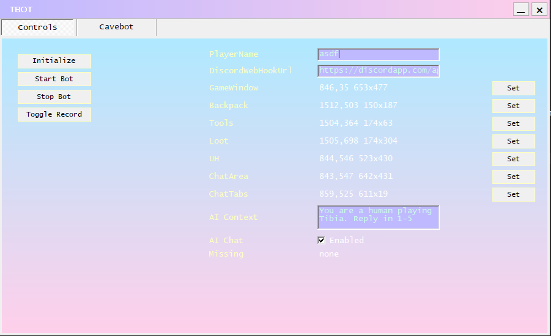
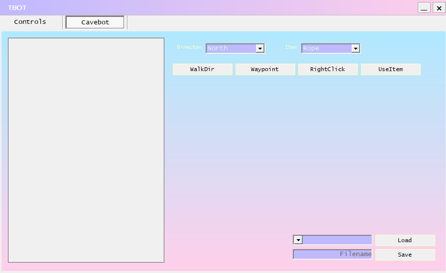

# Tibiantis Bot

A memory-reading bot for Tibiantis. Free and open source.

## Requirements

- Windows
- Visual Studio 2026

NuGet packages restore automatically on build.

## Installation

1. Clone or download the repository
2. Open the solution in Visual Studio
3. Build the project — NuGet dependencies will download automatically
4. Run the executable **as Administrator** — required for memory access

## Setup

set some cool name in AssemblyName .csproj

Before using the bot, configure the following fields in the Controls tab:

| Field | Description |
|---|---|
| **PlayerName** | Your in-game character name |
| **DiscordWebHookUrl** | Discord webhook URL for player alert notifications |
| **GameWindow** | Screen region of the game window — the playable area only, exclude bags and chat |
| **Backpack** | Screen region of your loot backpack. Make sure it is fully open. A second backpack inside it will open automatically when full |
| **Tools** | Screen region of the tools backpack, where rope and shovel are visible |
| **Loot** | Screen region where opened corpses appear. Extend the region to the bottom if you open multiple corpses at once |
| **UH** | Screen region of the UH backpack. Does not need to be fully open — as UHs are consumed the next backpack will appear automatically |
| **ChatArea** | Screen region of the chat messages area. Exclude tabs and the text input field |
| **ChatTabs** | Screen region of the chat tabs only |
| **AiContext** | System prompt for the AI chat. Has a default value but can be customized |
| **AI Chat** | Enable or disable AI chat. Disable if you do not have a local LLM installed |

The **Missing** indicator will highlight any fields that have not been configured.



### Initializing

Once all fields are configured, make sure the Tibiantis client is open and you are logged in. Press **Initialize**, then select the Tibiantis process from the menu. The Tibiantis window must be visible during initialization.

## Cavebot

The cavebot follows a sequence of waypoints and fights creatures along the route.



### Setting waypoints

Make sure the bot is initialized and you are in-game. Walk to a position and press **Add Waypoint** — the bot records your current coordinates.

### Navigation waypoints

| Action | How to set it up |
|---|---|
| Walk up/down stairs or holes | Add a waypoint next to the stairs, then add a **WalkDir** waypoint in the direction of the stairs |
| Enter a sewer | Add a waypoint next to the sewer, then add a **RightClick** waypoint in the direction of the sewer |
| Use a rope | Add a waypoint next to the rope spot, then add a **UseItem** waypoint with rope selected in the dropdown, in the direction of the rope spot |
| Use a shovel | Add a waypoint next to the shovel spot, then add a **UseItem** waypoint with shovel selected in the dropdown, in the direction of the shovel spot |

## Features

### Auto Loot
Automatically loots creatures after they are killed.

### Healer
Monitors HP and presses F1 when HP drops below 95%. Configure your healing spell on the F1 hotkey in the Tibiantis client.

### UH Healer
Uses a UH when HP drops below 50%.

### Auto Cast on Full Mana
Automatically presses F2 when mana is full. Configure your mana spell on the F2 hotkey in the Tibiantis client.

### Player Alerts
Detects other players on screen and sends a notification to your configured Discord webhook.

### AI Chat
Automatically replies to incoming public and private messages in-game to make the character appear active. Uses a local LLM — by default **llama3.1:8b** via Ollama at `http://localhost:11434/api/chat`.

You need to install [Ollama](https://ollama.com) and pull the model before enabling this feature:

```
ollama pull llama3.1:8b
```

The system prompt can be customized in the settings.

## Notes

- Built specifically for **Tibiantis**. May not work on other OT servers without modification.
- Administrator privileges are required. Windows will show a UAC prompt on launch.